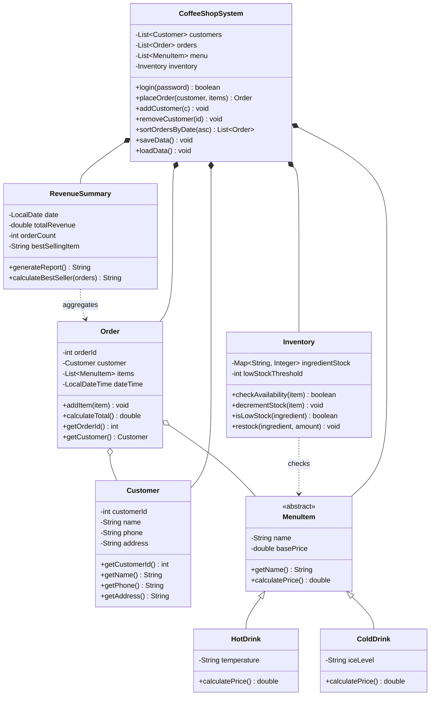

# Café Lumière — Coffee Shop Management System
 
A desktop coffee shop management system built in Java Swing for CSCI207 (Object-Oriented Programming), USAL University.
 
## Overview
 
Café Lumière lets a single owner manage daily café operations: taking orders, tracking ingredient inventory, and reviewing revenue.
 
## Features
 
- **Order entry** — select a customer and a fixed set of drinks, place an order, see the total calculated automatically
- **Inventory tracking** — ingredient stock decreases automatically per order; low-stock ingredients are flagged
- **Customer management** — add and remove customers
- **Revenue summary** — daily total revenue, order count, and best-selling drink (by order frequency)
- **Owner login** — single-owner access gate, no multi-user roles
- **Persistence** — all data (customers, orders, menu, inventory) is saved to file on close and loaded on startup
## Tech stack
 
| Layer | Choice |
|---|---|
| Language | Java |
| UI | Java Swing |
| UI components | [KControls](https://github.com/k33ptoo/KControls) (`KButton`, `KGradientPanel`) |
| Charts | [XChart](https://github.com/knowm/XChart) (bar chart for popular drinks) |
| Persistence | Java file serialization (`Serializable`, `ObjectOutputStream` / `ObjectInputStream`) — no database |
 
## Architecture
 
Full editable version on the [Figma board](https://www.figma.com/board/mDg9ctDhKL7xdbJJ17juTX/Welcome-to-FigJam). Class diagram:
 

