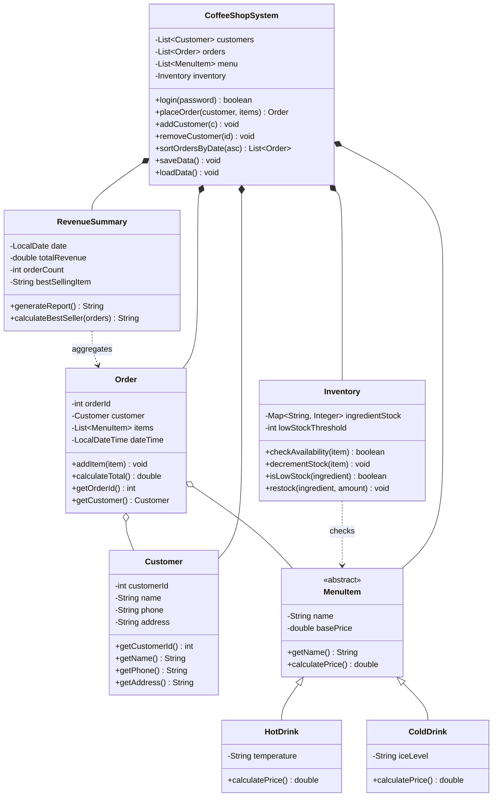

# Café Lumière — Coffee Shop Management System
 
A desktop coffee shop management system built in Java Swing for CSCI207 (Object-Oriented Programming), USAL University.
 
## Overview
 
Café Lumière lets a single owner manage daily café operations: taking orders, tracking ingredient inventory, and reviewing revenue.
 
## Features
 
- **Order entry** — select a customer and a fixed set of drinks, place an order, see the total calculated automatically
- **Inventory tracking** — ingredient stock decreases automatically per order; low-stock ingredients are flagged
- **Customer management** — add and remove customers
- **Revenue summary** — daily total revenue, order count, and best-selling drink (by order frequency)
- **Animated sidebar** — collapsible icon rail (240 px → 72 px) with a smooth slide driven by the Universal Tween Engine; click the hamburger to toggle
- **Owner login** — single-owner access gate, no multi-user roles
- **Persistence** — all data (customers, orders, menu, inventory) is saved to file on close and loaded on startup
## Tech stack
 
| Layer | Choice |
|---|---|
| Language | Java |
| UI | Java Swing |
| UI components | [KControls](https://github.com/k33ptoo/KControls) (`KButton`, `KGradientPanel`) |
| Charts | [XChart](https://github.com/knowm/XChart) (bar chart for popular drinks) |
| Animation | [Universal Tween Engine](https://github.com/arcnor/universal-tween-engine) (sidebar slide, easing curves) |
| Persistence | Java file serialization (`Serializable`, `ObjectOutputStream` / `ObjectInputStream`) — no database |
 
## Architecture
 
Full editable version on the [Figma board](https://www.figma.com/board/mDg9ctDhKL7xdbJJ17juTX/Welcome-to-FigJam). Class diagram:
 


## Project Structure

```
Coffee_Shop_Management_System/
├── pom.xml                          # Maven build config — dependencies, plugins
├── DESIGN_SYSTEM.md                 # Full UI design spec (colors, typography, components)
│
└── src/main/
    ├── java/com/cafelumiere/
    │   │
    │   ├── model/                   # Tier 1 — Data classes
    │   │   ├── MenuItem.java        # Abstract base class for all drinks
    │   │   ├── HotDrink.java        # Extends MenuItem (temperature field)
    │   │   ├── ColdDrink.java       # Extends MenuItem (iceLevel field)
    │   │   ├── Customer.java        # Customer data (id, name, phone, address)
    │   │   ├── Order.java           # Order data (customer, items, dateTime, total)
    │   │   └── Menu.java            # Fixed list of the 10 drinks
    │   │
    │   ├── inventory/               # Tier 2 — Logic
    │   │   └── Inventory.java       # Ingredient stock tracking (map + threshold)
    │   │
    │   ├── reports/                 # Tier 2 — Logic
    │   │   └── RevenueSummary.java  # Daily revenue KPIs (total, count, best seller)
    │   │
    │   ├── system/                  # Tier 3 — Controller
    │   │   └── CoffeeShopSystem.java# Central controller — all screens talk to this
    │   │
    │   └── ui/                      # Frontend (Java Swing)
    │       ├── Main.java            # App entry point, JFrame, CardLayout navigation
    │       ├── LoginScreen.java     # Login screen
    │       ├── Dashboard.java       # Dashboard (stat cards + chart + recent orders)
    │       ├── OrderEntryScreen.java# Order entry (customer selector + drink grid)
    │       ├── InventoryView.java   # Inventory table
    │       ├── RevenueSummaryView.java # Revenue stat cards + today's orders
    │       │
    │       ├── components/          # Reusable UI building blocks
    │       │   ├── Theme.java       # All design tokens (colors, fonts, spacing)
    │       │   ├── RoundedPanel.java# White card with rounded corners
    │       │   ├── StatCard.java    # KPI card with accent strip
    │       │   ├── DrinkCard.java   # Product card (image, price, qty, add to cart)
    │       │   ├── Badge.java       # Pill label (Warning / Success)
    │       │   ├── Table.java       # Alternating-row data table
    │       │   ├── Buttons.java     # KButton factory (Primary/Secondary/Danger)
    │       │   ├── SidebarNav.java  # Dark gradient sidebar with nav items
    │       │   ├── LabeledField.java# Text input with label and focus border
    │       │   └── ContentPage.java # Abstract base for all 4 main screens
    │       │
    │       └── theme/
    │           └── Theme.java       # Design token constants (moved here from components)
    │
    └── resources/
        ├── fonts/                   # Nunito TTF files (400, 600, 700 weights)
        ├── images/                  # Drink photos (hot_*.png / iced_*.png)
        ├── icons/                   # White PNG nav icons (dashboard, orders, inventory, revenue, menu)
        └── data/                    # Save files written by saveData() / loadData()
```

## Design System

Full spec: [`DESIGN_SYSTEM.md`](DESIGN_SYSTEM.md)

**Palette** — Warm earth tones. Dark browns for the sidebar and buttons, cream beiges for backgrounds and cards, white for surfaces.

| Role | Color |
|---|---|
| Brand brown | `#6F4E37` |
| Page background | `#FFF8F0` |
| Card background | `#FFFFFF` |
| Primary text | `#3B2314` |
| Secondary text | `#8B6B53` |
| Low-stock warning | `#B7472A` |
| In-stock success | `#5B7A3A` |

**Typography** — Nunito (bundled TTF). 28 pt display → 11 pt caption. All loaded via `Font.createFont()` at startup; falls back to `SansSerif`.

**Spacing** — 4 px base grid: `4 / 8 / 12 / 16 / 24 / 32 / 48 px`. Border radii: `4 / 8 / 12 / 16 px`.

**Components** (all in `src/main/java/com/cafelumiere/ui/components/`):

| Component | Description |
|---|---|
| `RoundedPanel` | White card with rounded corners — used everywhere |
| `StatCard` | KPI card with brown accent strip on the left |
| `DrinkCard` | Product card with circular image, price, qty stepper, Add to Cart |
| `Badge` | Pill label — Warning (red) or Success (green) |
| `Table` | Alternating-row table with header and empty state |
| `SidebarNav` | Dark brown gradient sidebar; hamburger toggle slides it between full (240 px) and icon rail (72 px) |
| `Buttons` | Factory for Primary / Secondary / Danger `KButton` variants |

**Swing constraints** — No blurred shadows, no gradients with 3+ colors, no CSS animations. State changes (hover, press) are instant color swaps. Images are PNG loaded via `ImageIcon`.
